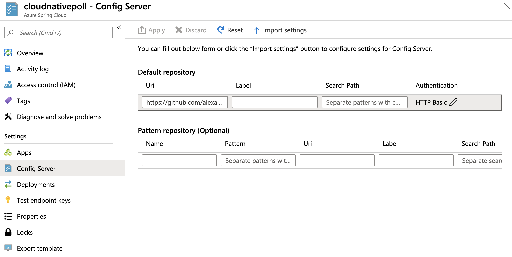
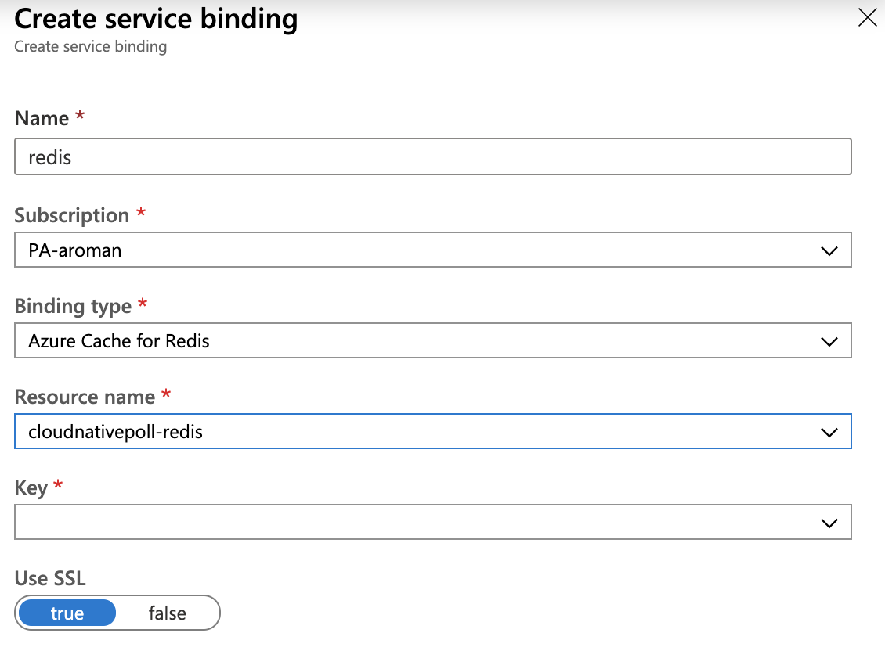
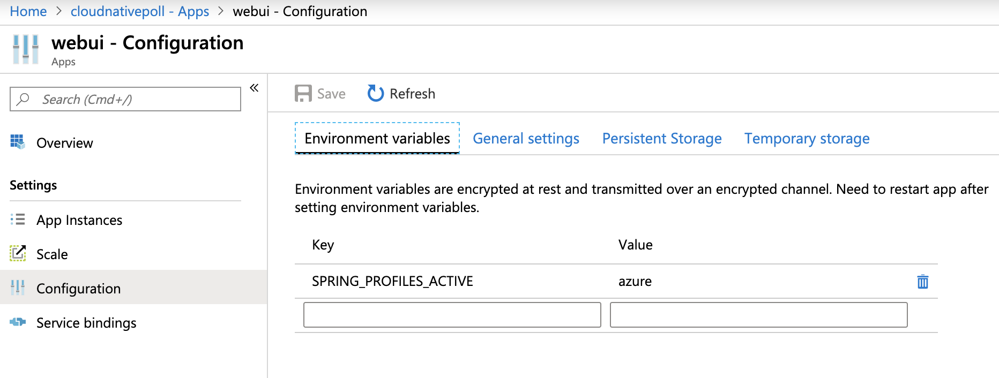
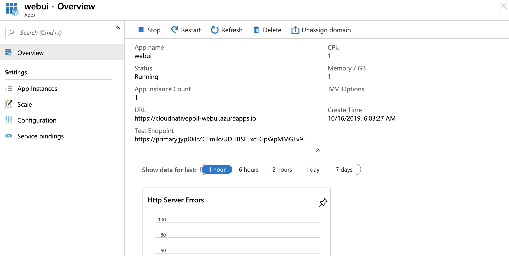

# Cloud-native Poll app

This project is a cloud-native implementation of a voting app, using modern technologies
like [Spring Boot](https://spring.io/projects/spring-boot),
[Spring Cloud](https://spring.io/projects/spring-cloud) and
[Spring Data](https://spring.io/projects/spring-data).

You can freely set up your own questions and thumbnails, using an external Git repository
read by Spring Cloud Config Server when the app starts.


## Compiling this app

This app is made of 2 microservices: a [backend](backend) and a
[Web UI frontend](frontend). These microservices leverage a RabbitMQ instance to share
messages and a Redis instance to store data. A Netflix Eureka Server is used as a
service registry.

You need a JDK 8+ to build this app:
```bash
$ ./mvnw clean package
```

## Running locally

Start a Redis instance using Docker:
```bash
$ docker run --rm -p 6379:6379/tcp redis:5
```

Start a RabbitMQ instance:
```bash
$ docker run --rm -p 5672:5672/tcp -p 15672:15672/tcp rabbitmq:3-management
```

The RabbitMQ management UI is available at http://localhost:15672:
use `guest` / `guest` to sign in.

Start a Netflix Eureka Server instance:
```bash
$ java -jar eureka-server/target/cloudnativepoll-eureka-server.jar
```

Start the backend:
```bash
$ java -jar backend/target/cloudnativepoll-backend.jar
```

Start the frontend:
```bash
$ java -jar webui/target/cloudnativepoll-webui.jar
```

The app is available at http://localhost:8080.

## Deploying to Pivotal Platform

Easily deploy this app to [Pivotal Platform](https://pivotal.io/platform)
using these commands:
```bash
$ cf create-service p-redis shared-vm redis
$ cf create-service p-rabbitmq standard rabbitmq
$ cf create-service p-service-registry standard service-registry
$ cf create-service -c '{"git": { "uri": "https://github.com/alexandreroman/cloudnativepoll-config", "cloneOnStart": "true" }}' p-config-server standard config-server
$ cf push
$ cf add-network-policy cloudnativepoll-webui --destination-app cloudnativepoll-backend
```

In case you're using [Pivotal Web Services](https://run.pivotal.io), use these commands:
```bash
$ cf create-service p.redis cache-small redis
$ cf create-service cloudamqp lemur rabbitmq
$ cf create-service p-service-registry trial service-registry
$ cf create-service -c '{"git": { "uri": "https://github.com/alexandreroman/cloudnativepoll-config", "cloneOnStart": "true" }}' p-config-server trial config-server
$ cf add-network-policy cloudnativepoll-webui --destination-app cloudnativepoll-backend
```

Note this app is leveraging Container-To-Container (C2C) networking between
frontend and backend instances. This way you don't need to expose a public route
for backend instances. All instances are discovered using a platform-managed
Netflix Eureka Server.

## Deploying to Azure Spring Cloud

Azure Spring Cloud is a new platform
[announced at SpringOne Platform 2019](https://azure.microsoft.com/en-us/blog/introducing-azure-spring-cloud-fully-managed-service-for-spring-boot-microservices/). 
Use this platform to run your Spring Boot apps on Azure.

Make sure to initialize Azure Spring Cloud with your subscription
[using this tutorial](https://github.com/microsoft/azure-spring-cloud-training/blob/master/01-create-a-cluster/README.md).

In this document, let's assume you initialize a Spring Cloud cluster named `cloudnativepoll`.

First, you need to recompile this app to include Azure dependencies and configuration:
```bash
$ ./mvnw clean package -Pazure
```

When this app is running on Azure, the backend leverages
[Azure Event Hubs](https://azure.microsoft.com/en-us/services/event-hubs)
and [Azure Redis Cache](https://azure.microsoft.com/en-us/services/cache).
**No source code update is required, thanks to the abstraction level provided by
Spring Boot and Spring Cloud.**

Initialize some variables based on your Azure Spring Cloud resources:
```bash
$ RES_GROUP=$(az spring-cloud list | jq -r ".[].resourceGroup")
$ RES_LOCATION=$(az spring-cloud list | jq -r ".[].location")
```

Create an Event Hubs namespace in your resource group:
```bash
$ az eventhubs namespace create --name cloudnativepoll --resource-group $RES_GROUP -l $RES_LOCATION
```

Create a storage account (choose a random name):
```bash
$ az storage account create -n cloudnativepoll -g $RES_GROUP -l $RES_LOCATION \
  --sku Standard_LRS --kind BlobStorage --access-tier Hot
```

Get the storage account access key:
```bash
$ az storage account keys list -g $RES_GROUP -n cloudnativepoll | jq -r '.[] | select(.keyName=="key1") | .value'
rHw8izcwjzNEzySbh8x0uV6mbWHOFQ88LaEjznbKU26GnEmCnGddImjlmcr7nLH0qzjDeSvWD5y6kB6tqbs9oQ==
```

Create Event Hubs instances (two queues are used by this app):
```bash
$ az eventhubs eventhub create --name cloudnativepoll-votes --resource-group $RES_GROUP --namespace-name cloudnativepoll
$ az eventhubs eventhub create --name cloudnativepoll-reset --resource-group $RES_GROUP --namespace-name cloudnativepoll
```

Create Event Hubs consumer groups:
```bash
$ az eventhubs eventhub consumer-group create --resource-group $RES_GROUP \
  --namespace-name cloudnativepoll --eventhub-name cloudnativepoll-votes --name voter
$ az eventhubs eventhub consumer-group create --resource-group $RES_GROUP \
  --namespace-name cloudnativepoll --eventhub-name cloudnativepoll-reset --name instance
```

Get the Event Hubs connection string:
```bash
$ az eventhubs namespace authorization-rule keys list --resource-group $RES_GROUP \
  --namespace-name cloudnativepoll --name RootManageSharedAccessKey | jq -r .primaryConnectionString
Endpoint=sb://cloudnativepoll.servicebus.windows.net/;SharedAccessKeyName=RootManageSharedAccessKey;SharedAccessKey=42+/uao51l7orrp3ydcTUDs43JKz2MqRtwI4eCf0RjC=
```

There is no support for binding an Event Hubs instance to Spring Boot apps at this time:
you'll need to set up a configuration file to include your Event Hubs credentials.

Create a private GitHub project to store app configuration
(this Git repository should be private to keep your Azure credentials secret).

In this repository, create a file `application-azure.yml`:
```yaml
# Set poll questions.
poll:
  question: Who's the most powerful Avenger?
  choices:
    - Iron Man
    - Captain America
    - Thor
    - Captain Marvel
  images:
    - https://images-na.ssl-images-amazon.com/images/S/cmx-images-prod/Item/24008/DEC100687_1._SX360_QL80_TTD_.jpg
    - https://images-na.ssl-images-amazon.com/images/S/cmx-images-prod/Item/14688/14688._SX360_QL80_TTD_.jpg
    - https://images-na.ssl-images-amazon.com/images/S/cmx-images-prod/Item/744376/744376._SX360_QL80_TTD_.jpg
    - https://images-na.ssl-images-amazon.com/images/S/cmx-images-prod/Item/149220/149220._SX360_QL80_TTD_.jpg

spring:
  cloud:
    azure:
      eventhub:
        # Include your Event Hubs connection string.
        connection-string: "Endpoint=sb://cloudnativepoll.servicebus.windows.net/;SharedAccessKeyName=RootManageSharedAccessKey;SharedAccessKey=42+/uao51l7orrp3ydcTUDs43JKz2MqRtwI4eCf0RjC="
        # Include your Azure storage credentials.
        checkpoint-storage-account: cloudnativepoll
        checkpoint-access-key: "rHw8izcwjzNEzySbh8x0uV6mbWHOFQ88LaEjznbKU26GnEmCnGddImjlmcr7nLH0qzjDeSvWD5y6kB6tqbs9oQ=="
```

Commit and push this file to the Git repository. Now create a Config Server instance
on your Azure Spring Cloud cluster, pointing to this Git repository:



This configuration file will be read by the Config Server: your apps running
on Azure Spring Cloud will then retrieve these configuration properties.

Create a Redis cache instance (choose a random name):
```bash
$ az redis create --name cloudnativepoll-redis --resource-group $RES_GROUP \
  --location $RES_LOCATION --vm-size P1 --sku Premium --shard-count 1
```

Create a backend app:
```bash
$ az spring-cloud app create -n backend
```

Create an app for the Web UI (this one is public):
```bash
$ az spring-cloud app create -n webui --is-public true
```

Bind the backend app to the Redis instance:



Then, go to app configuration for both `backend` and `webui` components and add
an environment variable `SPRING_PROFILES_ACTIVE` with the value set to `azure`:



This will enable profile `azure`: there are some custom configuration properties which
are set when running on Azure Spring Cloud.

Deploy the backend app to Azure:
```bash
$ az spring-cloud app deploy -n backend \
  --jar-path backend/target/cloudnativepoll-backend.jar
```

Deploy the Web UI to Azure:
```bash
$ az spring-cloud app deploy -n webui \
  --jar-path webui/target/cloudnativepoll-webui.jar
```

Please note that you don't need to build a Docker image: Azure Spring Cloud will take care of
building a container image for you.

As soon as both apps are deployed to your Azure Spring Cloud cluster, you should see components running with status `UP`:


Now, go to `webui` configuration page, and get the app URL:



In this example, hit https://cloudnativepoll-webui.azureapps.io to access the app.

## Using Concourse to build and deploy this app

A [Concourse](https://concourse-ci.org) pipeline is available is the directory [ci](ci):
 

This pipeline contains a generic job: use this template to create 2 jobs building
and deploying the 2 microservices.

Edit file [credentials.yml.template](ci/credentials.yml.template)
and create 2 copies for each microservice:
```yaml
app: cloudnativepoll-backend-or-webui

git-uri: https://github.com/alexandreroman/cloudnativepoll.git
git-branch: master
git-module: backend-or-webui

# This Git repo stores version files.
git-ci-uri: https://github.com/johndoe/myrepo.git
git-username: johndoe
git-password: accesstoken

# This pipeline deploys apps as GitHub releases.
github-owner: johndoe
github-repo: cloudnativepoll
github-access-token: accesstoken

# Enter your CF credentials here.
cf-api: api.run.pivotal.io
cf-username: johndoe@pivotal.io
cf-password: secret
cf-org: org
cf-space: dev

# Edit this entry to tune the CF manifest used to deploy an app.
cf-manifest: |
  ---
  applications:
  - name: ((app))
    path: ((app)).jar
```

Then, deploy these jobs using these commands:
```bash
$ fly -t concourse set-pipeline -p cnp-backend -c ci/pipeline.yml --load-vars-from ci/credentials-backend.yml
$ fly -t concourse set-pipeline -p cnp-webui -c ci/pipeline.yml --load-vars-from ci/credentials-webui.yml
```

## Contribute

Contributions are always welcome!

Feel free to open issues & send PR.

## License

Copyright &copy; 2019 [Pivotal Software, Inc](https://pivotal.io).

This project is licensed under the [Apache Software License version 2.0](https://www.apache.org/licenses/LICENSE-2.0).
