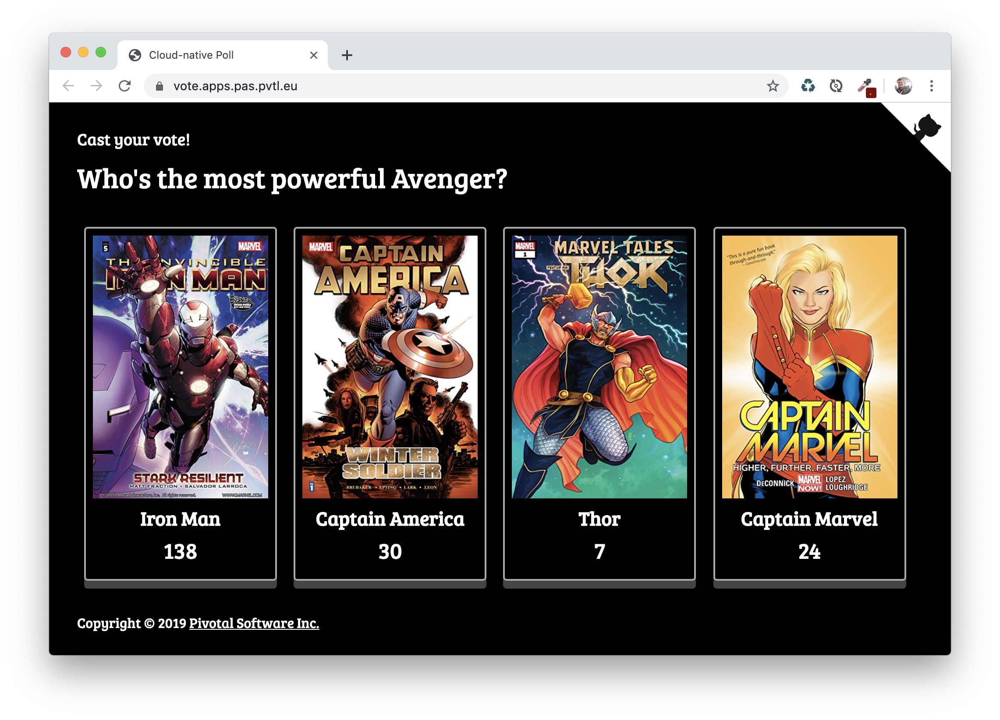
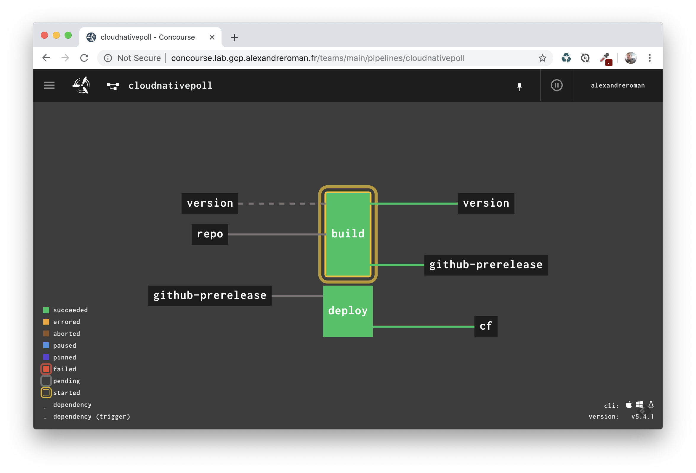

# Cloud-native Poll app

This project is a cloud-native implementation of a voting app, using modern technologies
like [Spring Boot](https://spring.io/projects/spring-boot),
[Spring Cloud](https://spring.io/projects/spring-cloud) and
[Spring Data](https://spring.io/projects/spring-data).

You can freely set up your own questions and thumbnails, using an external Git repository
read by Spring Cloud Config Server when the app starts.



## Compiling this app

This app is made of 2 microservices: a [backend](backend) and a
[Web UI frontend](frontend). These microservices leverage a RabbitMQ instance to share
messages and a Redis instance to store data. A Netflix Eureka Server is used as a
service registry.

You need a JDK 8+ to build this app:
```bash
$ ./mvwn clean package
```

## Running locally

Start a Redis instance using Docker:
```bash
$ docker run --rm -p 6379:6379/tcp redis:5
```

Start a RabbitMQ instance:
```bash
$ docker run --rm -p 5672:5672/tcp -p 15672:15672/tcp rabbitmq:3-management
```

The RabbitMQ management UI is available at http://localhost:15672:
use `guest` / `guest` to sign in.

Start a Netflix Eureka Server instance:
```bash
$ java -jar eureka-server/target/cloudnativepoll-eureka-server.jar
```

Start the backend:
```bash
$ java -jar backend/target/cloudnativepoll-backend.jar
```

Start the frontend:
```bash
$ java -jar frontend/target/cloudnativepoll-webui.jar
```

The app is available at http://localhost:8080.

## Deploying to Pivotal Platform

Easily deploy this app to [Pivotal Platform](https://pivotal.io/platform)
using these commands:
```bash
$ cf create-service p-redis shared-vm redis
$ cf create-service p-rabbitmq standard rabbitmq
$ cf create-service p-service-registry standard service-registry
$ cf create-service -c '{"git": { "uri": "https://github.com/alexandreroman/cloudnativepoll-config", "cloneOnStart": "true" }}' p-config-server standard config-server
$ cf push
$ cf add-network-policy cloudnativepoll-webui --destination-app cloudnativepoll-backend
```

In case you're using [Pivotal Web Services](https://run.pivotal.io), use these commands:
```bash
$ cf create-service p.redis cache-small redis
$ cf create-service cloudamqp lemur rabbitmq
$ cf create-service p-service-registry trial service-registry
$ cf create-service -c '{"git": { "uri": "https://github.com/alexandreroman/cloudnativepoll-config", "cloneOnStart": "true" }}' p-config-server trial config-server
$ cf add-network-policy cloudnativepoll-webui --destination-app cloudnativepoll-backend
```

Note this app is leveraging Container-To-Container (C2C) networking between
frontend and backend instances. This way you don't need to expose a public route
for backend instances. All instances are discovered using a platform-managed
Netflix Eureka Server.

## Using Concourse to build and deploy this app

A [Concourse](https://concourse-ci.org) pipeline is available is the directory [ci](ci):
 

This pipeline contains a generic job: use this template to create 2 jobs building
and deploying the 2 microservices.

Edit file [credentials.yml.template](ci/credentials.yml.template)
and create 2 copies for each microservice:
```yaml
app: cloudnativepoll-backend-or-webui

git-uri: https://github.com/alexandreroman/cloudnativepoll.git
git-branch: master
git-module: backend-or-webui

# This Git repo stores version files.
git-ci-uri: https://github.com/johndoe/myrepo.git
git-username: johndoe
git-password: accesstoken

# This pipeline deploys apps as GitHub releases.
github-owner: johndoe
github-repo: cloudnativepoll
github-access-token: accesstoken

# Enter your CF credentials here.
cf-api: api.run.pivotal.io
cf-username: johndoe@pivotal.io
cf-password: secret
cf-org: org
cf-space: dev

# Edit this entry to tune the CF manifest used to deploy an app.
cf-manifest: |
  ---
  applications:
  - name: ((app))
    path: ((app)).jar
```

Then, deploy these jobs using these commands:
```bash
$ fly -t concourse set-pipeline -p cnp-backend -c ci/pipeline.yml --load-vars-from ci/credentials-backend.yml
$ fly -t concourse set-pipeline -p cnp-webui -c ci/pipeline.yml --load-vars-from ci/credentials-webui.yml
```

## Contribute

Contributions are always welcome!

Feel free to open issues & send PR.

## License

Copyright &copy; 2019 [Pivotal Software, Inc](https://pivotal.io).

This project is licensed under the [Apache Software License version 2.0](https://www.apache.org/licenses/LICENSE-2.0).
